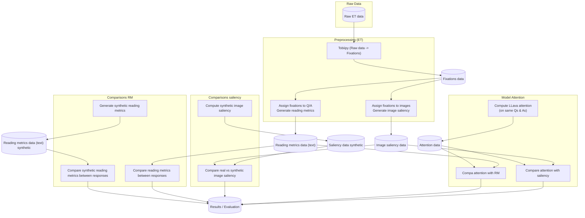

# VLFeedback-ET study

## Project Workflow

## Dependencies
- See requirements.txt for full list of dependencies

### data

### process_et_data 
    #TODO ADD CODE FOR PROCESSING ET DATA

### generate_syntethic_data
    #TODO ADD CODE FOR GENERATING SYNTHETIC DATA calling the generative models

### analyse_data
    #TODO ADD CODE FOR ANALYSE DATA comparing both RM and saliency for chosen vs rejected
    
   

### attention

### attention_saliency
    #TODO ADD CODE FOR COMPARE ATTENTION MLLMS WITH HUMAN SALIENCY